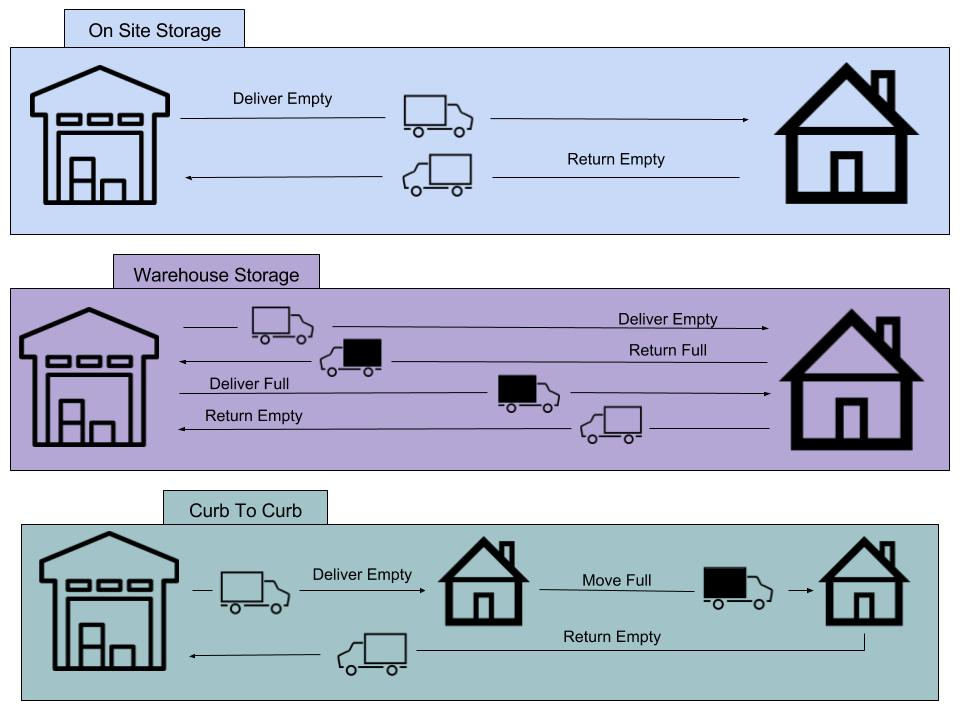

# Units Manager App

This app is designed to track the work flow of a mobile storage company. There are four models:
- Units
- Customers
- Deliveries
- Transactions

## Units

Units are the actual storage containers used by the customers. They can be full or empty and stored at an offsite location or in the warehouse. Each Unit can have a specific rental price, to allow the user to adjust for market fluctuations. Once they are created in the system they will almost never be deleted.

## Customers

Customers can be associated with multiple Units or a single Unit. A customer should be associated with a single transaction. There are three different rental types that a customer could fall into. The three types are:
1. On Site Storage
1. Warehouse Storage
1. Curb To Curb

These rental types are represented by a graphic below: 

## Deliveries

Deliveries can be scheduled on the main Dashboard (but only once a customer has been created). Once the initial delivery has been scheduled on the main dashboard, subsequent deliveries can be scheduled via the Units Dashboard. Any delivery that is scheduled for today will appear on the main Dashboard, there they can be marked as complete. Once a delivery is marked as complete it will be added to the customers Transaction.

## Transactions

A transaction will keep track of all deliveries and containers.
